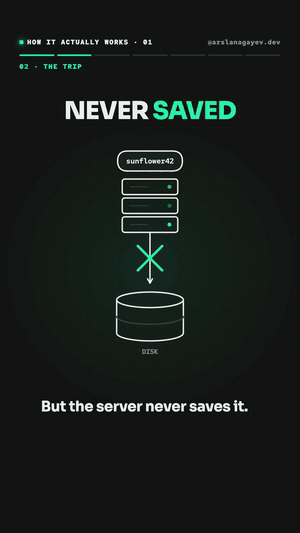

<div align="center">

# Explainer Engine

**Code-driven explainer videos. A script and a voice-over go in; a word-synced, animated 9:16 Reel comes out.**

[](https://github.com/arslanagayev/explainer-engine/actions/workflows/ci.yml)
[](LICENSE)




### [▶ Watch episode 1 on Instagram](https://www.instagram.com/reel/DeR35Fpkgh7/)

</div>

I use this engine for **How it actually works**, a series of one-minute videos that explain everyday tech: where your password goes, what happens when you open a website, how a contactless card pays without a battery, and how end-to-end encryption hides your messages.

Every frame is drawn by code. Each sentence of the voice-over gets its own scene, and the animation inside a scene is timed to the individual words: the salt types itself out as the narrator says "salt", the counter races to a billion on "billions".

## Episodes

### Series 1: How it actually works

Complete: four episodes, about a minute each.

| # | Topic | Video |
| - | ----- | ----- |
| 01 | Where does your password go? Salting, hashing and why "forgot password" sends a link | [Reel](https://www.instagram.com/reel/DeR35Fpkgh7/) |
| 02 | What happens when you open a website? DNS, the handshake, a secret key that never travels, and how the page gets built | [Reel](https://www.instagram.com/reel/DeR7AltkwWq/) |
| 03 | What happens when you tap your card? A battery-free chip powered by the reader, and a one-time code your bank checks | [Reel](https://www.instagram.com/reel/DeSA308Dyw7/) |
| 04 | How can nobody read your messages? Public and private keys as a padlock, per-message keys, security codes, and the metadata catch | [Reel](https://www.instagram.com/reel/DeSIxW5CsqK/) |

### Series 2: How languages actually work

Under a minute each, one look for the whole series (black + luminous green, Space Grotesk + Fira Code). Every language gets the same beats: where it came from, how it runs, its signature idea, hello world, where it is used.

| # | Topic | Video |
| - | ----- | ----- |
| 00 | How does code actually run? Ones and zeros, compilers, interpreters and virtual machines | [Reel](https://www.instagram.com/reel/DeS-6BIj3cC/) |
| 01 | C | coming soon |
| 02 | C++ | coming soon |
| 03 | Java | coming soon |
| 04 | C# | coming soon |
| 05 | Python | coming soon |
| 06 | JavaScript | coming soon |
| 07 | TypeScript | coming soon |
| 08 | SQL | coming soon |
| 09 | HTML and CSS | coming soon |
| 10 | Go | coming soon |
| 11 | Rust | coming soon |
| 12 | Kotlin and Swift | coming soon |
| 13 | PHP | coming soon |
| 14 | Assembly | coming soon |


## How it works

```mermaid
flowchart LR
  S[script.md<br/>one line = one scene] --> V[Text to speech<br/>voice.mp3]
  V --> W[Speech to text<br/>words.json with timestamps]
  S --> T[build_timing.py<br/>timing.json]
  W --> T
  T --> P[player.html + episode.js<br/>seek&#40;t&#41; draws any frame]
  P --> R[make.mjs<br/>Chrome DevTools Protocol<br/>captures 30 fps]
  T --> B[soundbed.py<br/>music bed + whooshes]
  R --> F[ffmpeg<br/>voice ducks the bed<br/>loudness -14 LUFS]
  B --> F
  V --> F
  F --> M[reel.mp4<br/>1080x1920]
```



1. **Script.** `script.md` holds the voice-over, one sentence per line. Each line becomes one scene.
2. **Voice and timestamps.** The script is voiced with text-to-speech, then transcribed again with speech-to-text to get the start and end of every word.
3. **Timing.** `build_timing.py` matches the transcript to the script line by line (and fails loudly if a word is missing or different), producing `timing.json`.
4. **Deterministic player.** `player.html` loads an episode and exposes `seek(t)`, which draws the frame at exactly `t` seconds: the SVG scene, the headline with its accent word, the chapter progress bar and karaoke captions. Nothing depends on wall-clock time, so a frame always looks the same however long it takes to draw.
5. **Frame capture.** `make.mjs` serves the repository, opens the player in headless Chrome, and steps through time at 30 fps over the DevTools protocol, saving a screenshot per frame. Rendering speed doesn't matter, so audio and video can't drift.
6. **Sound.** `soundbed.py` synthesises a quiet four-chord pad and a whoosh before each scene in pure Python. ffmpeg mixes the voice on top with sidechain ducking, normalises loudness for Instagram (-14 LUFS) and encodes H.264 in limited-range BT.709.

### Scenes are small pure functions

A scene gets its local time `t` and the start time of every spoken word `w[k]`, and returns SVG. Helpers in `engine/lib.js` turn progress values into drawing, typing, popping and fading (simplified from episode 1):

```js
{ // "First, it adds a few random characters. That's called a salt."
  headline: 'Add a *salt*',
  draw: ({ t, w }) => {
    const n = Math.floor(SALT.length * seg(t, w[4], w[6] + 0.2)) // type the salt while "few random characters" is spoken
    return text(x0, 330, PW, { size, cls: 't m' }) +
      text(sx, 330, SALT.slice(0, n), { size, cls: 't m ac' }) +
      text(sx + 115, 450, 'SALT', { size: 40, cls: 't ac', opacity: seg(t, w[10], w[10] + 0.3) }) // on the word "salt"
  },
}
```

Because every scene is a pure function, the test suite can render each one every 0.1 s and check that no `NaN` or `undefined` ever reaches the SVG.

## Make a video

Requirements: Node.js 22+, Python 3.9+, ffmpeg and Google Chrome (or Chromium). No npm packages.

```bash
git clone https://github.com/arslanagayev/explainer-engine.git
cd explainer-engine
node engine/make.mjs ep01-password                      # -> episodes/ep01-password/out/reel.mp4
node engine/make.mjs ep01-password --stills 3,20,27     # a few frames, for checking a scene
npm test                                                # Node + Python tests
```

To preview with sound in a browser, serve the folder (for example `python3 -m http.server`) and open `engine/player.html?ep=ep01-password&play`, then click.

### Adding an episode

1. Create `episodes/<name>/script.md` with a `## Voice-over` section, one sentence per line.
2. Generate `voice.mp3` with any text-to-speech service, and `words.json` (`{"words": [{"text", "start", "end"}]}`) with any speech-to-text service that returns word timestamps.
3. Write `episode.js`: a theme (colours and fonts), chapters and one scene per line.
4. Run `node engine/make.mjs <name>`.

## Project structure

```text
engine/
  player.html       Deterministic player: seek(t), headline, chapters, karaoke captions
  lib.js            Drawing helpers: animated paths, arrows, typing, pop/fade, seeded random
  props.js          Shared props: laptop, server, database, lock, pills, gears
  build_timing.py   Script + word timestamps -> timing.json (one line = one scene)
  soundbed.py       Synthesised music bed and scene whooshes (no dependencies)
  make.mjs          Static server + headless Chrome frame capture + ffmpeg mix and encode
episodes/
  ep01-password/    script.md, episode.js, voice.mp3, words.json, timing.json, caption.md
  ep02-website/     same layout; every episode has its own colours and fonts
  ep03-card/
  ep04-messages/
  lang00-how-code-runs/   series 2, one episode per language
tests/              Node tests for the helpers and every episode, Python tests for timing
docs/               Preview GIF and scene sheet
```

## Design

Each episode uses one two-colour combination from [@design.deb](https://www.instagram.com/design.deb/)'s colour combos and its own typefaces:

- Episode 1: Tiffany `#21F1A8` + Dark Gray `#171717`, [Sora](https://fonts.google.com/specimen/Sora) and [Red Hat Mono](https://fonts.google.com/specimen/Red+Hat+Mono).
- Episode 2: True Pink `#FD1843` + Chill White `#FFF9FA`, [Bricolage Grotesque](https://fonts.google.com/specimen/Bricolage+Grotesque) and [Azeret Mono](https://fonts.google.com/specimen/Azeret+Mono).
- Episode 3: Turmeric `#FFBE0B` + Malt `#2A2312`, [Syne](https://fonts.google.com/specimen/Syne) and [Spline Sans Mono](https://fonts.google.com/specimen/Spline+Sans+Mono).
- Episode 4: Skin Tone `#FFC6A8` + Bridal `#741A2F`, [Fraunces](https://fonts.google.com/specimen/Fraunces) and [Sometype Mono](https://fonts.google.com/specimen/Sometype+Mono). The visuals use generic phones and padlocks, no messenger branding.
 The format (a question, a myth busted, the mechanism step by step with "but what if…?" twists, and a callback ending) was inspired by short-form explainer videos.

## Credits

- Voice-over: [ElevenLabs](https://elevenlabs.io) text to speech ("Liam"), word timestamps from ElevenLabs Scribe.
- Music bed and sound effects are synthesised in code.

## License

Code is MIT licensed. See [LICENSE](LICENSE).
